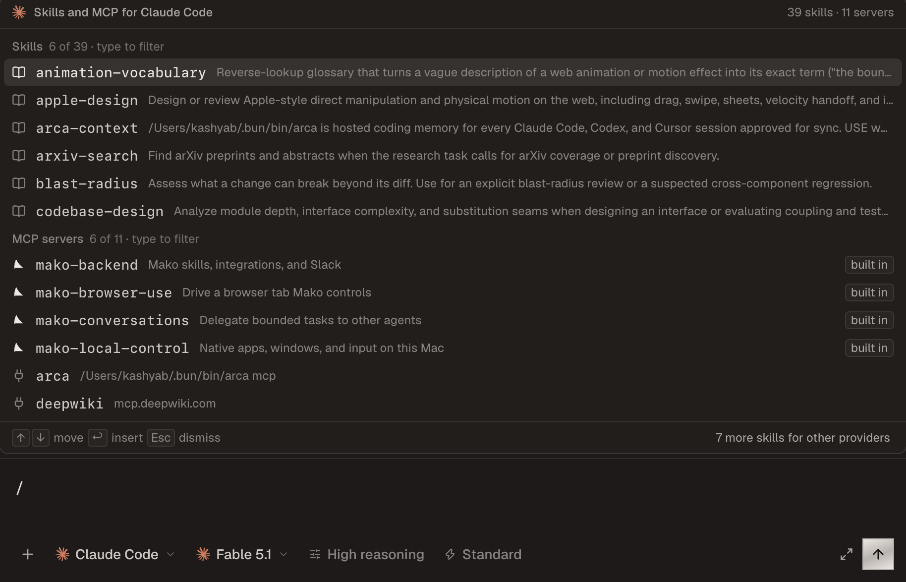
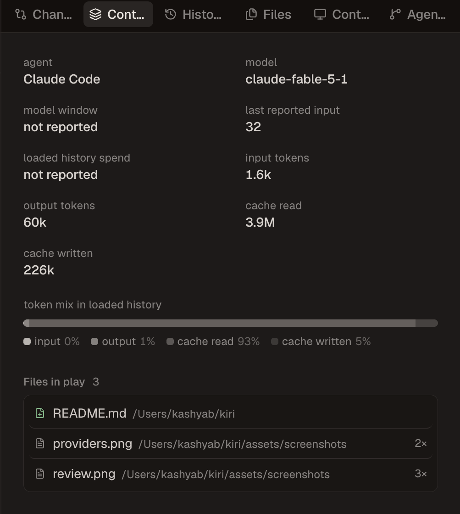
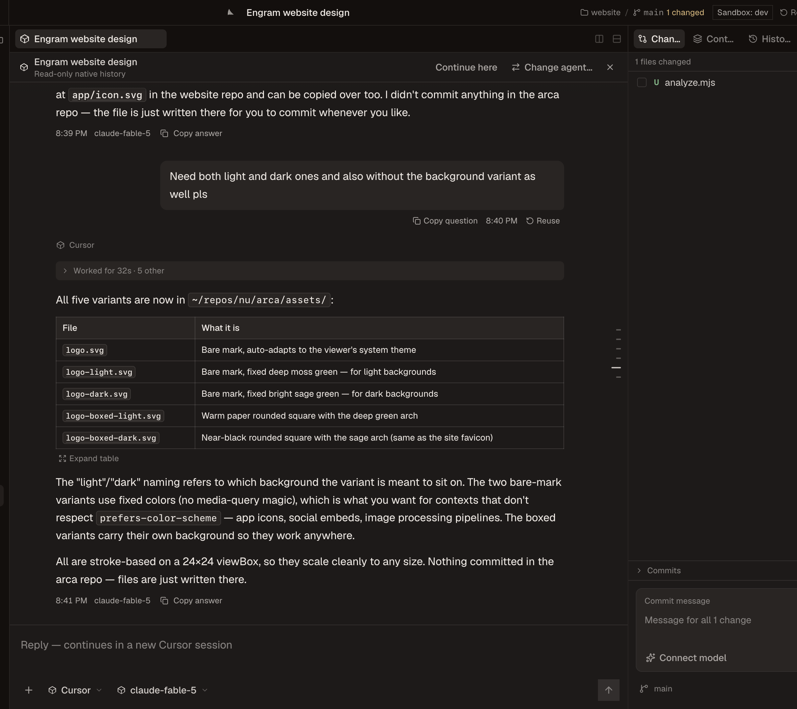

<p align="center">
  
</p>

<h1 align="center">Mako</h1>

<p align="center">
  One desktop app for Claude Code, Codex, Cursor, Grok, Devin, and OpenCode.
</p>

<p align="center">
  <a href="https://github.com/kashyab12/mako/releases"></a>
  
  <a href="LICENSE"></a>
  <a href="https://github.com/kashyab12/mako/actions/workflows/release.yml"></a>
</p>

<p align="center">
  
</p>

Mako is a macOS workspace for AI coding agents. It finds the sessions your
agent CLIs already created, opens them live, and lets you resume each one with
the tool that made it or hand it to a different agent. Several agents run at
once, each in its own thread, beside the git diff and the files they touch.

If you keep six terminal tabs open for six different agents, this is the one
window that replaces them.

## What it does

- Runs every supported agent side by side. Each thread keeps its own provider,
  model, reasoning effort, and permission mode.
- Lists sessions from Mako, your terminal, Zed, and other ACP clients, grouped
  by project and ordered by activity.
- Streams text, reasoning, tool calls, plans, permission prompts, and subagent
  work as they happen.
- Resumes a session through its original CLI, or continues it with a different
  agent using a deterministic transcript.
- Shows the working tree next to the conversation: changed files, diffs,
  commits, a commit-message drafter, and push.
- Opens files in tabs beside the chat, with split panes and a terminal dock.
- Lists the selected agent's skills and MCP servers when you type `/` or `$`.
- Shows context and token usage per session when the provider reports real
  numbers. No estimates dressed up as readings.
- Runs browser and computer-use tools locally. Slack requests queue while the
  Mac is offline and run when it is back.

<table>
  <tr>
    <td width="62%"></td>
    <td width="38%"></td>
  </tr>
</table>

## Sessions from other tools

<p align="center">
  
</p>

Mako reads each tool's own session store. Credentials stay with the tool that
owns them, and the interface only ever sees a redacted, provider-neutral view.

| Provider | Discover | Follow live | Resume | Transport |
| --- | :---: | :---: | :---: | --- |
| Claude Code | yes | yes | yes | ACP |
| Codex | yes | yes | yes | app-server |
| Cursor | yes | yes | yes | ACP |
| Grok | yes | yes | yes | ACP |
| Devin | yes | yes | yes | ACP |
| OpenCode | yes | yes | yes | ACP |

Completed tool calls fold into a work log under the answer they produced.
A running turn stays open with live activity. An interrupted turn is marked
interrupted, not presented as finished work.

## Install

Mako ships for Apple-silicon Macs and is **not signed or notarized by Apple**.
Read the [installer](scripts/install-macos.sh) first, then run:

```bash
curl -fsSL https://github.com/kashyab12/mako/releases/latest/download/install-macos.sh | bash
```

The script downloads the DMG and its published checksum, verifies the DMG
before mounting it, copies only Mako into Applications, and removes quarantine
from that one app. It does not change Gatekeeper or any other macOS policy.
Unsigned builds cannot verify automatic updates, so re-run the same command to
update. See [macOS distribution](docs/macos-release.md) for the full
disclosure and manual DMG steps.

### Run from source

Requires Node.js 24, Git, and at least one supported agent CLI.

```bash
git clone https://github.com/kashyab12/mako.git
cd mako
npm install
npm run desktop
```

`npm run dev` serves the same interface in a browser against your real
sessions. Reload UI picks up renderer edits without restarting agents, and
`npm run dev:hot` makes that automatic. A source checkout keeps its own data
directory, so it runs beside the installed app. Opening a thread never starts
an agent. Sending a prompt does.

## Keyboard

| Keys | Action |
| --- | --- |
| `⌘K` | Command palette |
| `⌘N` | New session |
| `⌘T` | Attach another session |
| `⌘P` | Open a file |
| `⌘⇧F` | Search files and conversations |
| `⌘⇧L` | Search sessions |
| `⌘J` | Terminal dock |
| `⌘B` / `⌘⌥B` | Session list / right sidebar |
| `⌘1`, `⌘2` … | Chat, then each right-sidebar surface in order |
| `⌘⇧G` | Draft a commit message |
| `⌘⇧M` | Switch model |
| `⌘⎋` | Stop the current turn |
| `⌘/` | What is where |

## How it is built

```text
Claude Code · Codex · Cursor · Grok · Devin · OpenCode
                        │
                        ▼
        Electron host + @mako/sessions
   provider processes · session stores · git
                        │
                        ▼
                 React renderer
```

The host owns provider processes, native session formats, credentials, and
Git. The renderer speaks one wire contract. Streaming sends only the message in
flight, long lists are virtualized, and unchanged sessions are never reread.
Every provider is installed from one module and no provider gets a privileged
path. [AGENTS.md](AGENTS.md) has the full set of rules.

## Security

- Provider credentials stay in provider storage or the macOS Keychain.
- The host strips secrets before anything reaches the interface.
- Slack verifies timestamped signatures against a team and user allowlist.
  Running your own bot is documented in
  [Run your own Mako Slack bot](docs/self-hosted-slack.md).
- Browser and computer-use tools run on your machine. There is no cloud
  browser mode.
- Crash reports stay on disk until you choose to share one.

## Development

```bash
npm run lint
npm run typecheck:all
npm test --workspace @mako/sessions
```

Read [AGENTS.md](AGENTS.md) before touching provider or host code.

## License

[MIT](LICENSE) © 2026 Verbiflow. Provider names and marks belong to their
respective owners.
