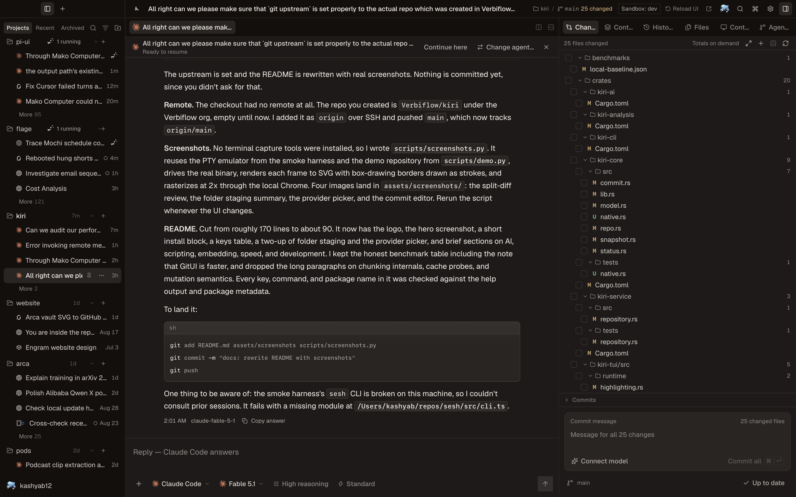
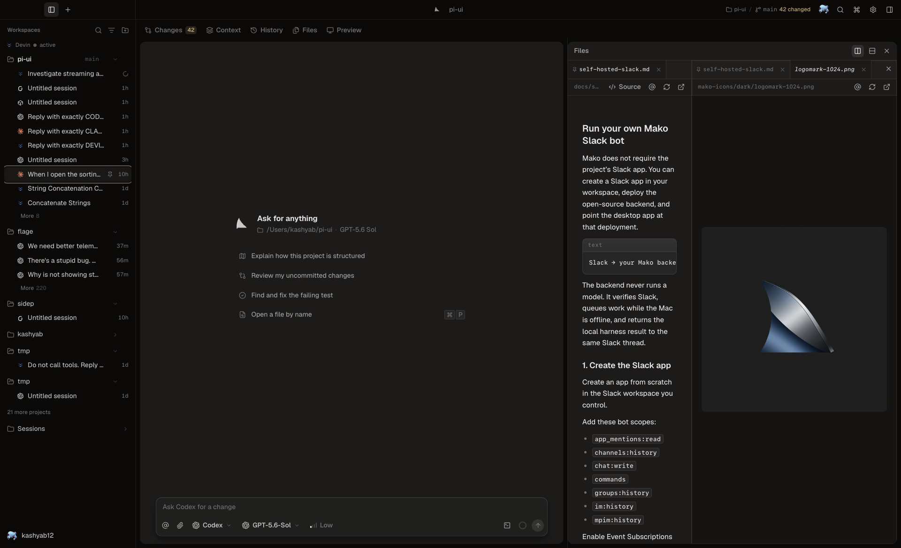
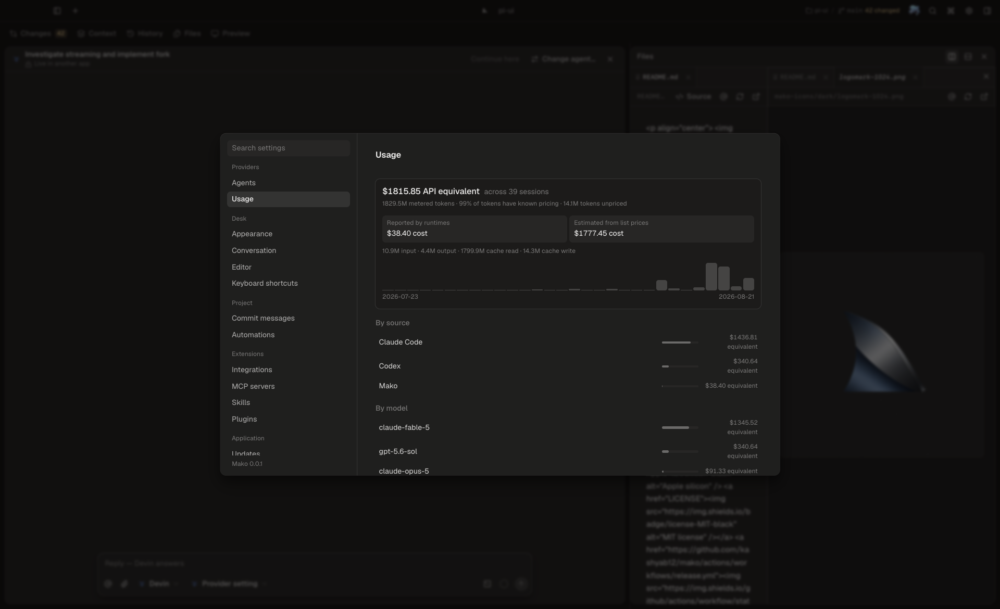
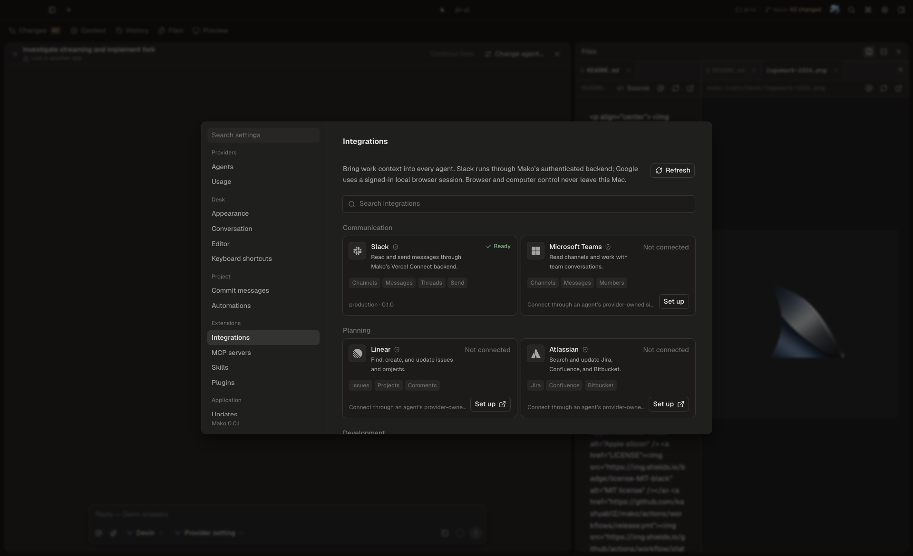

<p align="center">
  
</p>

<h1 align="center">Mako</h1>

<p align="center">
  Run coding agents on your Mac.
</p>

<p align="center">
  <a href="https://github.com/kashyab12/mako/releases"></a>
  
  <a href="LICENSE"></a>
  <a href="https://github.com/kashyab12/mako/actions/workflows/release.yml"></a>
</p>

<p align="center">
  
</p>

Mako finds sessions created by the supported CLIs and apps. Open a session to
watch it update, resume it with the tool that created it, or continue it with a
different tool.

## What it does

- Runs multiple agent sessions concurrently.
- Lists sessions created in Mako, a terminal, Zed, and other ACP clients.
- Streams text, reasoning, tools, plans, permissions, and subagent activity.
- Resumes sessions through their original CLI.
- Moves conversations between supported agents using a deterministic transcript.
- Shows changed files, diffs, commits, pull requests, context, and terminals.
- Runs browser and computer-use tools locally.
- Queues Slack requests while the Mac is offline, then runs them locally.

## File workbench

<p align="center">
  
</p>

The conversation stays open next to the file viewer. Files open in preview tabs;
double-click a tab to keep it. Split the file area right or down.

Mako renders:

- source code with syntax highlighting
- Markdown as source or formatted text
- workspace images referenced by Markdown
- PNG, JPEG, GIF, WebP, SVG, and AVIF
- PDF, audio, and video
- CSV and TSV tables with bounded rows and columns
- macOS Quick Look thumbnails for Excel and Numbers files

Open files can also be sent to Zed, Cursor, VS Code, Windsurf, Sublime Text, or
Xcode. Mako detects which editors are installed.

## Sessions and providers

| Provider | Discover | Follow while running | Resume | Interactive transport |
| --- | :---: | :---: | :---: | --- |
| Claude Code | yes | yes | yes | ACP |
| Codex | yes | yes | yes | app-server |
| Cursor | yes | yes | yes | ACP |
| Grok | yes | yes | yes | ACP |
| Devin | yes | yes | yes | ACP |
| OpenCode 2 / OpenCode | yes | yes | yes | ACP |

Mako reads each tool’s session store directly. Credentials stay with the tool
that owns them. The renderer receives a redacted, provider-independent IPC
contract.

Completed tool calls are grouped into a work log. A running turn stays open and
shows live activity. Interrupted turns are labeled as interrupted instead of
being presented as completed work. Subagent assignments and results are
available inside the same work log.

## Accounts and usage

<p align="center">
  
</p>

Mako reads account identity and rate-limit windows from provider credentials and
provider endpoints. It preserves the windows as reported.

The Usage page scans local Claude Code, Codex, OpenCode, and Mako history. It
separates costs reported by a runtime from estimates based on current API list
prices. Estimates are not billing totals.

## Integrations

<p align="center">
  
</p>

Slack works with a bot and backend you control. The project’s Vercel Connect
configuration is optional. See [Run your own Mako Slack bot](docs/self-hosted-slack.md)
for the Slack app scopes, Azure queue, environment variables, and desktop setup.

Browser and computer-use integrations run locally. Mako does not offer a cloud
browser mode.

## Install

Mako currently ships for Apple-silicon Macs and is **not signed or notarized by
Apple**. Read the [installer](scripts/install-macos.sh), then run:

```bash
curl -fsSL https://github.com/kashyab12/mako/releases/latest/download/install-macos.sh | bash
```

The installer downloads the DMG and published checksum from GitHub, verifies the
DMG before mounting it, copies only Mako into Applications, and removes
quarantine only from that copied app. It does not disable Gatekeeper globally or
change macOS security policy. See [macOS distribution](docs/macos-release.md)
for the complete security disclosure and manual DMG instructions.

Unsigned builds cannot safely authenticate automatic updates. Re-run the same
installer command to update Mako.

### Run from source

Requirements: Node.js 24, Git, and at least one supported agent CLI.

```bash
git clone https://github.com/kashyab12/mako.git
cd mako
npm install
npm run desktop
```

For interface work without starting an agent:

```bash
npm run dev
open 'http://127.0.0.1:5173/?mock'
```

## Useful shortcuts

| Shortcut | Action |
| --- | --- |
| `⌘K` | Open the command palette |
| `⌘P` | Open a file |
| `⌘⇧F` | Search files and conversations |
| `⌘T` | Start a session |
| `⌘1–9` | Switch session tabs |
| `⌘↑ / ⌘↓` | Move between conversation turns |
| `⌘/` | Show keyboard help |
| `Esc` | Stop or close the current activity |

## Architecture

```text
Claude Code · Codex · Cursor · Grok · Devin · OpenCode
                           │
                           ▼
              Electron host + @mako/sessions
          processes · session stores · git · credentials
                           │
                           ▼
                    React renderer
```

The host owns processes, credentials, native session formats, and Git. The
renderer uses one IPC contract. Streaming sends only the current message;
unchanged sessions are not reread. Long lists are virtualized and syntax
highlighting loads when a file is opened.

## Build and release

```bash
npm run lint
npm run typecheck:all
npm run package:mac
```

`npm run package:mac` writes the fixed-name DMG, ZIP, blockmaps, and updater
metadata to `release/`. A `v*` tag verifies the package, copies the disclosed
installer, writes checksums, and publishes the GitHub Release only after those
checks pass. Until the project joins the Apple Developer Program, release notes
and installation documentation explicitly identify builds as unsigned.

The same workflow automatically raises its bar to Developer ID, notarization,
stapler, and Gatekeeper verification when all protected Apple credentials are
configured. See [macOS distribution](docs/macos-release.md).

## Security

- Provider credentials remain in provider storage or macOS Keychain.
- Secrets are removed before data crosses IPC.
- Slack verifies timestamped signatures and checks a team and user allowlist.
- Automation definitions start disabled on a new machine.
- Browser and computer-use tools run locally.
- Crash reports remain on disk unless the user copies one.

## Development

Read [AGENTS.md](AGENTS.md) before changing provider or IPC architecture.

```bash
npm run typecheck:all
npm run lint
npm test --workspace @mako/sessions
npm run backend:test
```

## License

[MIT](LICENSE) © 2026 Verbiflow. Provider names and marks belong to their
respective owners.
