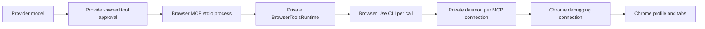

# Browser permissions and model tools audit

Audited September 7, 2026. This is an investigation of the current implementation, not a claim that the findings below are fixed.

Chrome's connection approval is real, but Mako amplifies it by tying a browser connection to an MCP connection. The previous change traded shared-tab interference for connection churn. That was an incomplete fix. Passing form tests did not establish a usable permission lifecycle or correct behavior when a tab disappears.

## Can permission be granted once?

For the existing-profile connection method Mako uses, approval covers a debugging connection. Calls over that connection reuse it. Opening another connection requests approval again. The setting that enables remote debugging and the approval of an incoming connection are separate decisions. Chrome's official explanation describes this behavior; the request for persistent approval is closed as not planned. [Chrome documentation](https://developer.chrome.com/blog/chrome-devtools-mcp-debug-your-browser-session), [persistent approval request](https://github.com/ChromeDevTools/chrome-devtools-mcp/issues/825).

I also checked the source matching the installed Chrome version, 152.0.7977.76. In approval mode, `OnWebSocketRequest` invokes `AcceptDebugging` for an incoming browser connection, and the Chrome delegate shows `DevToolsConnectionDialog`. Keeping the settings toggle enabled does not skip this path. [Version-matched HTTP handler](https://github.com/chromium/chromium/blob/152.0.7977.76/content/browser/devtools/devtools_http_handler.cc#L749), [version-matched Chrome delegate](https://github.com/chromium/chromium/blob/152.0.7977.76/chrome/browser/devtools/chrome_devtools_manager_delegate.cc#L484).

This audit did not repeatedly disconnect the user's active Chrome to count visible dialogs. Chrome was already displaying its automation banner. The conclusion comes from the exact-version Chromium implementation, the installed dependency, and Mako's lifecycle, not an assumed interpretation of that banner.

## Current path from model to browser



`managedMcpDefinitions` in `electron/mcp-registry.ts` discovers the executable and advertises a managed stdio server. `electron/mcp-runtime.ts` projects it into ACP and Codex configuration. Provider implementations retain execution and tool-approval ownership. The browser wrapper itself does not carry a Mako conversation ID, task grant, or browser profile selection.

`createBrowserToolsServer` constructs one `BrowserToolsRuntime`. Its first use allocates fresh home, config, runtime, temporary and workspace directories. Each execution starts a CLI process, but the daemon remains between calls within that MCP connection. On MCP close, EOF or a handled termination signal, Mako calls `--reload`, stops the daemon and removes the directory. A replacement MCP connection gets another directory and daemon. New provider sessions and task restarts can therefore create additional Chrome handshakes. MCP initialization and tool listing alone do not connect to Chrome.

The installed packages are `browser-use 0.13.7`, `browser-harness 0.1.8`, and `cdp-use 1.4.5`. Mako finds them from the local environment; its package lock does not pin this executable. The wrapper relies on private Python names such as `helpers._send` and `_ipc.pid_path` without a compatibility negotiation.

## Findings

| Priority | Finding and consequence | Evidence |
|---|---|---|
| P1 | Browser connection lifetime follows MCP lifetime. Multiple tasks and provider restarts can repeatedly request Chrome permission. Closing a task discards the connection that was approved. | `electron/browser-tools-main.ts` server factory and close handlers; `electron/browser-tools-runtime.ts` environment and shutdown; existing runtime test confirms distinct directories and per-runtime shutdown. |
| P1 | The installed daemon retries a command on another tab after a stale-session error. Mako checks daemon generation, which stays unchanged in this case. A mutation can succeed against the wrong tab. | Executed the installed `Daemon.handle` and `attach_first_page` against fake CDP responses. `Input.insertText` was attempted on `closed-session`, then `unrelated-session`, and returned success. See the reproduction below. |
| P1 | The advertised `ensure_real_tab` helper defeats the wrapper's blank-tab isolation. From the initial blank tab it selects the first non-internal page from the browser's catalog. | Executed the installed helper with a blank current tab and an unrelated existing page. It selected the unrelated page. The MCP execution description explicitly advertises this helper. |
| P1 | Approval waiting is hidden inside a tool call. Dependency stderr announces a pending Chrome dialog, but Mako buffers it until process completion. There is no host event for awaiting permission and no shared pending connection for other tasks to join. | `runBrowserUse` buffers stdout/stderr; the dependency waits up to 45 seconds for the WebSocket handshake. Mako imposes a 60-second overall limit. Dependency bootstrap can perform additional startup attempts. |
| P2 | Browser readiness means the executable exists. Settings can say ready with Chrome closed, remote debugging disabled, or a new connection awaiting approval. | `managedMcpDefinitions` uses executable availability; `localBrowserConnection` in `electron/integrations.ts` maps any available record to ready. |
| P2 | The reconnect tool does not reconnect. It removes the binding file and reports success. The next exec performs connection work, may ask permission, and creates a blank tab. | `BrowserToolsRuntime.reconnect`. Its response is a binding reset, not evidence of a usable Chrome connection. |
| P2 | Restart detection happens after the dependency has bootstrapped a new daemon. Even a command Mako ultimately refuses can already have caused another Chrome prompt. | `browser_harness.run.main` calls `ensure_daemon` before executing Mako's generation guard. |
| P2 | The model interface lacks a complete operational contract. No server instructions are supplied; helpers are named without signatures. There are no typed status, tab-selection, navigation or action tools, structured permission errors, or screenshot identity metadata. | Captured actual MCP initialize and tools/list responses in `browser-model-tool-contract.json`. Browser tools are doctor, reconnect, screenshot and arbitrary Python exec. |
| P2 | Multiple overlapping control systems are injected without a model-facing routing rule. The legacy macOS wrapper returns text even for its capture tool; the browser wrapper and embedded CUA have different image and targeting contracts. | `electron/local-tools-main.ts`, `electron/browser-tools-main.ts`, `electron/cua-embedded.ts`, and the captured tool contract. No server instructions on either Mako wrapper. |
| P2 | Cancellation terminates the CLI process group, not an already-dispatched command in the detached browser daemon. The model only receives a generic canceled/timed-out error. | CLI process termination in the wrapper; detached spawn in `_ipc.spawn_kwargs`; daemon request handling has no cancellation protocol. Whether an in-flight browser action completed remains unknown. This is a source finding, not a measured post-cancel form submission. |
| P2 | Diagnostics and screenshots have misleading limits or metadata. Doctor can contact PyPI despite `openWorldHint: false`, and a healthy cold runtime reports no daemon. PNG base64 shares the 2 MiB output cap, so an image near 1.5 MiB can exhaust it. | Installed `admin.run_doctor`, `_latest_release_tag`, wrapper annotations and combined byte accounting. |

The Python executor is trusted local code execution. The remote-operation regex and environment filtering prevent some accidental hosted-browser selection; they do not enforce browser-only execution, site permissions or filesystem isolation. Arbitrary Python can access the process environment and operating system. This needs honest capability disclosure and the provider's appropriate execution approval. It should not be presented as a sandboxed browser action interface.

The daemon also activates selected tabs and changes their document titles with a marker. Browser Use's auto-discovery checks multiple supported Chromium browser profiles. The wrapper's phrase "local Chrome" is not an explicit browser/profile identity guarantee.

## Three separate permission systems

| Permission | Owner | What it grants | Reuse |
|---|---|---|---|
| Accessibility and Screen Recording | macOS | Application observation and input through the desktop control path | Associated with application identity; signing/build changes and OS policy matter. Does not approve CDP. |
| Incoming remote debugging connection | Chrome | Debugging access to the running browser through this connection | Reused while that connection remains alive; a new connection re-enters Chrome approval. |
| Tool execution | Each provider | Permission to call the model's tool under that provider's policy | Once/session behavior comes from provider options. Does not answer Chrome's native dialog. |

The embedded CUA driver already has a host-managed lifetime in `electron/cua-embedded.ts`, with a private socket and host bundle identity. That is a useful ownership precedent. It does not mean its macOS grant can be reused as Chrome approval. Its native executable internals were not re-audited here, and its browser capabilities should not be assumed equivalent to Browser Use.

## Recommended design

For the existing browser, Mako should own one lazy connection per explicitly selected browser/profile, independent of provider and MCP processes. Concurrent first calls should join one pending connection attempt. Task closure should release that task's browser binding while preserving the connection for the host session. An explicit disconnect or host shutdown closes it. Chrome restart or permission revocation can still require approval again.

Share the transport, not the current tab. Each task needs its own exact target/session binding and connection generation. Every action must carry that identity through the transport. Lost tabs must produce a typed target-closed result; they must never select another page and retry. Events and dialogs must be routed to their owning session. Two tasks intentionally controlling the same tab need an explicit ownership rule. Simply sharing `BH_HOME`, or putting a global queue around the existing daemon, would restore the earlier interference problem. A local WebSocket proxy alone would not fix the daemon's stale-tab retry either.

The UI should distinguish unavailable, disconnected, connecting, awaiting Chrome approval, connected, and revoked. MCP should expose matching structured state and progress. Permission acquisition should happen before action dispatch. A timeout after dispatch must report that the result is unknown and require observation before any new attempt.

Give the model a small documented interface for status, tab discovery, explicit selection/opening, observation, screenshots and actions. Return browser/tab identity with every observation, and actual image blocks for captures. Keep arbitrary local execution clearly identified as a separate capability. Encode routing guidance in the tool contract so ordinary user prompts do not need to name the implementation or list helper functions.

For a lasting reduction in setup friction, evaluate these supported transport choices:

| Choice | Existing signed-in browser | Approval experience | Cost |
|---|---|---|---|
| Host-owned persistent CDP connection | Yes | One connection approval while that connection survives; reapproval after disconnect/restart | Closest correction to current implementation; requires proper task bindings and lifecycle. |
| Mako browser extension with debugger/native messaging | Yes | Extension install/permission flow rather than this remote-debugging WebSocket dialog; Chrome can still display debugging UI or detach | Requires an extension, authenticated pairing, lifecycle handling and testing of the available CDP domains. |
| Mako-managed persistent browser profile | Separate sign-in | Avoids the existing-profile connection approval flow | Own browser/profile lifecycle, separate login state and browser UI. |

Chrome documents `chrome.debugger` as an alternate transport, with a declared permission and a restricted set of CDP domains. It is a candidate, not an already implemented Mako feature or a promise that Chrome will never show UI. [Debugger API](https://developer.chrome.com/docs/extensions/reference/api/debugger).

A dedicated automation profile is also supported. Since Chrome 136, debugging command-line switches do not apply to the default Chrome data directory; a nonstandard user-data directory is required. Chrome recommends Chrome for Testing for automation. Adding a launch flag to the user's ordinary profile is therefore not the proposed fix. [Chrome debugging-switch changes](https://developer.chrome.com/blog/remote-debugging-port).

## Evidence and acceptance checks

`probe-browser-dependency.py` imports the actual installed dependency and uses fake CDP responses. It changes no installed source, connects to no browser, and targets no personal tabs. Run it with the Python interpreter belonging to the Browser Use installation. On this machine:

```sh
/Users/kashyab/.local/share/uv/tools/browser-use/bin/python docs/audits/2026-09-07/probe-browser-dependency.py
```

The saved `browser-dependency-evidence.json` includes package versions, source hashes, and both confirmed reproduction traces. Its successful assertions mean the defects reproduced, not that the product passed acceptance.

The current MCP regression suite and Electron build pass. Lint passes with zero Oxlint warnings/errors and two existing ESLint virtualization warnings. Actual initialize/tools-list responses were captured without connecting to Chrome. Previous paid Codex and Claude form runs establish that the model can complete the coached screenshot/form workflow. Their prompt explicitly names the tool family, and their harness grants each recognized tool once. They do not establish autonomous tool selection or acceptable permission frequency.

A replacement must be verified against these behaviors before handoff:

1. Ten sequential and concurrent task sessions produce one initial Chrome connection request while the host connection survives. Ordinary tool calls and provider restarts add none.
2. Denial and revocation reach both UI and model as typed state, without a retry loop. A pending approval is visible while the dialog still exists.
3. Two tasks interleave actions, screenshots, navigation and dialog handling without crossing target identities. Closing A's tab refuses A's next mutation and leaves B untouched.
4. Chrome/daemon restart invalidates all old bindings before any action. No interrupted mutation is replayed; action outcome uncertainty survives timeout and cancellation.
5. Provider restart can recover its task binding while host transport stays alive. Host shutdown closes owned transport; crashes do not leave unbounded daemons or unknown controlling sessions.
6. Plain user requests complete across providers without prompting the model with implementation names. Images, permission state and target identity remain available after continuation.
7. Verify browser selection, multiple profiles, large screenshots and local dependency compatibility explicitly.

The new findings are unresolved in this audit. The previous report's no-replay and exact-tab statements apply only to the paths it tested; the dependency-level stale-session path disproves a broader guarantee.
